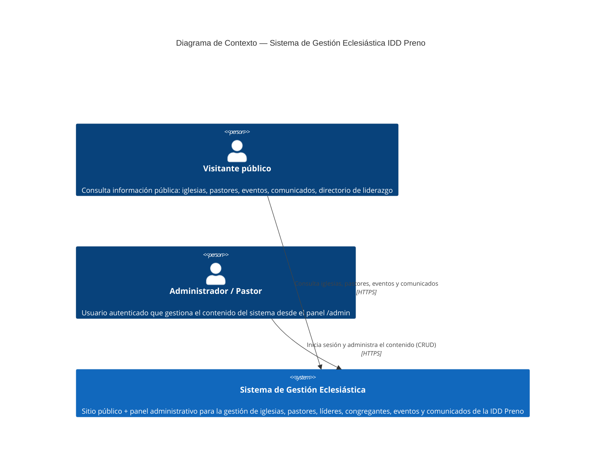

# C4 — Nivel 1: Diagrama de Contexto

Vista de más alto nivel: el sistema iglesia-api/iglesia como una sola caja, y quién interactúa con él desde afuera. No hay sistemas externos de terceros (no hay pasarela de pago, servicio de correo, almacenamiento en la nube ni proveedor de autenticación externo) — las fotos de iglesias, pastores, congregantes y eventos se guardan como base64 directamente en MySQL (`@db.LongText`), y la autenticación es propia (JWT + bcrypt), sin dependencias externas.

## Actores

- **Visitante público**: cualquier persona que navega `nuevo.iddprenoch.com` sin sesión iniciada. Solo tiene acceso de lectura a las rutas públicas (prerenderizadas en build: listado de iglesias, directorio de liderazgo, eventos, comunicados).
- **Administrador / Pastor**: usuario con credenciales (`Usuario` + `Rol` en la base de datos) que inicia sesión contra `/api/auth` y accede al panel `/admin/**`, renderizado 100% en el navegador (ver [ADR-004](../adr/adr-004-rendermode-client-admin.md)).

## Alcance del sistema

El sistema completo (frontend Angular + API Express + base de datos MySQL) vive dentro de un único plan de hosting compartido cPanel — no hay servicios externos que crucen ese límite. El detalle de cómo se reparten las responsabilidades dentro de esa caja se documenta en el [Nivel 2 — Contenedores](nivel2-contenedores.md).
