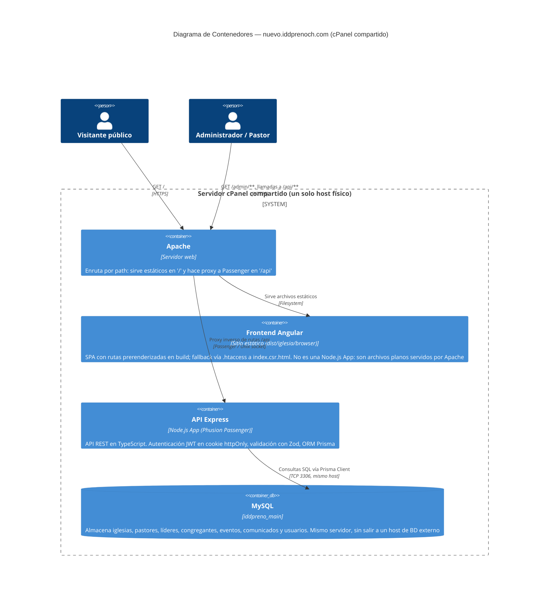

# C4 — Nivel 2: Diagrama de Contenedores

Esta vista refleja la arquitectura **real de producción**, no un plan intermedio. El detalle más importante de este nivel es que los dos "contenedores" de aplicación (Angular y Express) **no son infraestructura separada**: viven en el mismo servidor físico compartido de cPanel, y quien decide a cuál de los dos entregar cada petición es Apache, según la ruta — no un balanceador ni una red distinta.



## Por qué no son "contenedores" en el sentido de infraestructura separada

- **Angular** se compila (`ng build`) a HTML/CSS/JS estático en `dist/iglesia/browser` y se sube tal cual por FTP a `public_html/nuevo.iddprenoch.com`. Apache lo sirve como cualquier sitio estático; no hay proceso Node vivo detrás. El archivo `.htaccess` (versionado en `public/`, copiado automáticamente a cada build) resuelve el fallback de SPA:

  ```apache
  RewriteEngine On
  RewriteCond %{REQUEST_FILENAME} !-f
  RewriteCond %{REQUEST_URI} !^/api/
  RewriteRule ^ /index.csr.html [L]
  ```

  Esta arquitectura reemplazó un diseño anterior con SSR (Angular Universal) que sí corría como una segunda Node.js App — la razón completa del cambio está en [ADR-005](../adr/adr-005-frontend-estatico-vs-ssr.md).

- **Express** sí corre como proceso Node vivo, pero administrado por Phusion Passenger (el "Setup Node.js App" de cPanel), no por un orquestador de contenedores ni un servicio separado — es el mismo host físico, solo un proceso más bajo un gestor distinto al de Apache.

- **MySQL** corre en el mismo servidor (`iddpreno_main`), alcanzable por Prisma vía `DATABASE_URL` apuntando a `localhost`. No hay una capa de red ni un proveedor de base de datos gestionado externo — ver el porqué en [ADR-002](../adr/adr-002-mysql-vs-postgresql.md).

El nivel de detalle interno de la API se documenta en [Nivel 3 — Componentes del backend](nivel3-componentes-backend.md).
