# C4 — Nivel 3: Componentes del Backend (API Express)

Detalle interno del contenedor "API Express" del [Nivel 2](nivel2-contenedores.md). No se documenta un Nivel 4 (código): a este tamaño de proyecto, el nivel de componentes ya es suficiente para explicar la estructura real.

```mermaid
C4Component
    title Diagrama de Componentes — API Express (iglesia-api)

    Container_Boundary(api, "API Express") {
        Component(app, "app.ts", "Express App", "Composición de middlewares globales y montaje de routers bajo /api")
        Component(helmet, "helmet + cors + compression", "Middlewares globales", "Cabeceras de seguridad, CORS y compresión de respuesta")
        Component(rateLimiter, "rateLimiter", "Middleware (express-rate-limit)", "Limita a 5 intentos / 15 min el endpoint de login; store en memoria del proceso")
        Component(requireAuth, "requireAuth", "Middleware (auth.middleware.ts)", "Verifica el JWT de la cookie httpOnly y adjunta req.user; rechaza con 401 si falta o es inválido")
        Component(errorHandler, "errorHandler / notFoundHandler", "Middleware (error.middleware.ts)", "Traduce errores (ApiError, Prisma.PrismaClientKnownRequestError) a respuestas JSON consistentes con código y mensaje")
        Component(modAuth, "modules/auth", "Módulo", "Login, logout, emisión y verificación de JWT")
        Component(modIglesias, "modules/iglesias", "Módulo", "CRUD de iglesias")
        Component(modPastores, "modules/pastores", "Módulo", "CRUD de pastores")
        Component(modLideres, "modules/lideres", "Módulo", "CRUD de líderes de ministerio")
        Component(modCongregantes, "modules/congregantes", "Módulo", "CRUD de congregantes")
        Component(modMinisterios, "modules/ministerios", "Módulo", "CRUD de ministerios")
        Component(modDistritos, "modules/distritos", "Módulo", "CRUD de distritos")
        Component(modEventos, "modules/eventos", "Módulo", "CRUD de eventos")
        Component(modComunicados, "modules/comunicados", "Módulo", "CRUD de comunicados")
        Component(modUsuarios, "modules/usuarios", "Módulo", "CRUD de usuarios administradores")
        Component(modCargos, "modules/cargos", "Módulo", "Catálogo de cargos pastorales")
        Component(modCatalogos, "modules/catalogos", "Módulo", "Catálogos de apoyo: sexo, estado civil, estado eclesial, estado de usuario")
        Component(prisma, "Prisma Client", "ORM", "Acceso tipado a MySQL, generado desde schema.prisma")
    }

    ContainerDb(mysql, "MySQL", "iddpreno_main")

    Rel(app, helmet, "usa")
    Rel(app, modAuth, "monta en /api/auth")
    Rel(modAuth, rateLimiter, "protege POST /login con")
    Rel(app, modIglesias, "monta en /api/iglesias")
    Rel(app, modPastores, "monta en /api/pastores")
    Rel(app, modLideres, "monta en /api/lideres")
    Rel(app, modCongregantes, "monta en /api/congregantes")
    Rel(app, modMinisterios, "monta en /api/ministerios")
    Rel(app, modDistritos, "monta en /api/distritos")
    Rel(app, modEventos, "monta en /api/eventos")
    Rel(app, modComunicados, "monta en /api/comunicados")
    Rel(app, modUsuarios, "monta en /api/usuarios")
    Rel(app, modCargos, "monta en /api/cargos")
    Rel(app, modCatalogos, "monta en /api")

    Rel(modIglesias, requireAuth, "protege rutas de escritura con")
    Rel(modPastores, requireAuth, "protege rutas de escritura con")
    Rel(modLideres, requireAuth, "protege rutas de escritura con")
    Rel(modCongregantes, requireAuth, "protege rutas de escritura con")
    Rel(modUsuarios, requireAuth, "protege rutas de escritura con")

    Rel(app, errorHandler, "captura errores de todos los módulos con")

    Rel(modIglesias, prisma, "usa")
    Rel(modPastores, prisma, "usa")
    Rel(modLideres, prisma, "usa")
    Rel(modCongregantes, prisma, "usa")
    Rel(modMinisterios, prisma, "usa")
    Rel(modDistritos, prisma, "usa")
    Rel(modEventos, prisma, "usa")
    Rel(modComunicados, prisma, "usa")
    Rel(modUsuarios, prisma, "usa")
    Rel(modCargos, prisma, "usa")
    Rel(modCatalogos, prisma, "usa")
    Rel(modAuth, prisma, "usa")

    Rel(prisma, mysql, "SQL", "TCP 3306")
```

## Middlewares clave

- **`requireAuth`** (`src/middlewares/auth.middleware.ts`): lee el JWT de la cookie `auth_token`, lo valida con `jwt.verify` y adjunta `req.user`. Si falta la cookie o el token es inválido/expirado, responde 401 vía `ApiError` antes de llegar al controlador.
- **`errorHandler` / `notFoundHandler`** (`src/middlewares/error.middleware.ts`): único punto de traducción de errores a JSON. Reconoce `ApiError` (errores de aplicación con código HTTP explícito) y los códigos de Prisma más comunes (`P2002` conflicto de unicidad, `P2025` no encontrado, `P2003` referencia inválida), devolviendo siempre `{ error: { code, message } }`. En `development`, además adjunta el stack trace.
- **`loginRateLimiter`** (`src/middlewares/rateLimiter.ts`): limita `POST /api/auth/login` a 5 intentos cada 15 minutos. El store es en memoria del proceso — en Passenger esto se reinicia con cada restart del proceso (deploy, idle spin-down, crash), lo cual es una limitación conocida y documentada en el propio código, aceptable a esta escala (instancia única, sin scaling horizontal).

## Estructura por módulos

Cada entidad del dominio (`iglesias`, `pastores`, `lideres`, `congregantes`, `ministerios`, `distritos`, `eventos`, `comunicados`, `usuarios`, `cargos`) sigue el mismo patrón de tres capas: `*.routes.ts` (definición de endpoints y middlewares aplicados) → `*.controller.ts` (parseo de request/response) → `*.service.ts` (lógica de negocio y acceso a Prisma), con `*.schema.ts` para validación de entrada con Zod. `catalogos` agrupa los catálogos de solo lectura (sexo, estado civil, estado eclesial, estado de usuario) que no ameritan un módulo propio cada uno.
