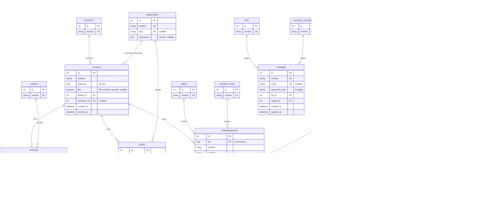

# Diagrama Entidad-Relación

Generado a partir del `schema.prisma` real del backend (`provider = "mysql"`). Refleja el modelo de datos vigente en producción, no un diseño preliminar.

## Contexto de volumen de datos

El sistema administra actualmente **48 iglesias reales** distribuidas en distritos, junto con sus pastores, líderes de ministerio y congregantes asociados. Es un volumen de datos pequeño y con crecimiento lento (altas y bajas administrativas, no tráfico transaccional), lo que respalda varias decisiones de arquitectura documentadas en los ADR (mantener todo en un único servidor MySQL compartido, no particionar ni tener réplicas, no necesitar caché distribuida).

## Diagrama

## Notas sobre el mapeo a MySQL

Todos los modelos usan `@@map` a nombres de tabla en snake_case (p. ej. `Iglesia` → `iglesias`, `Congregante` → `congregantes`) y `@map` para columnas compuestas (`distritoId` → `distrito_id`). Los campos de texto largo (direcciones, descripciones, fotos e imágenes en base64) se marcan explícitamente con `@db.Text` o `@db.LongText` — el porqué de esa auditoría se explica en [ADR-002](adr/adr-002-mysql-vs-postgresql.md).
